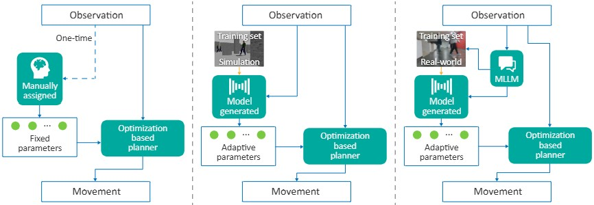
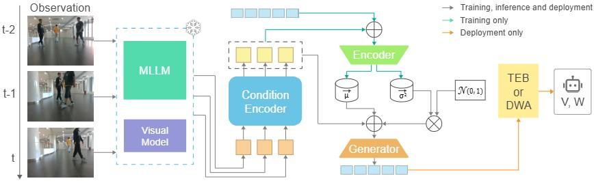

# Learning to Tune Like an Expert: Interpretable and Scene-Aware Navigation via MLLM Reasoning and CVAE-Based Adaptation

This repo is the official project repository of **LE-Nav** ([\[DEMO\]](https://drive.google.com/file/d/1_XVsA-nbONcEre_OyEVM9BInMulYK7_r/view?usp=sharing)).

<p align="center">
  
  
  
  
</p>

<div align="left">

## 1. Overview


LE-Nav is an interpretable and adaptive navigation framework designed for service robots operating in dynamic, human-centric environments. Traditional navigation systems often struggle in such unstructured settings due to fixed parameters and poor generalization. LE-Nav addresses this by combining multi-modal large language models (MLLMs) with conditional variational autoencoders (CVAEs) for zero-shot scene understanding and expert-level parameter tuning.



## 2. Environment
Download the code and create environment.
```
conda env create -f environment.yml
```
You can also try:
```
conda create --name readscene python=3.9
conda activate readscene
```
Install dependencies.
```
pip install openai 
conda install pytorch==2.1.0 torchvision==0.16.0 torchaudio==2.1.0 pytorch-cuda=12.1 -c pytorch -c nvidia
pip install numpy==1.22.4
conda install tensorboard
pip install ultralytics
```
or
```
pip install -r requirements.txt
```
## 3. Training
Collect the data for your planner. Customize your config.yaml.
```
python train_cvae.py
```
## 4. Deployment
Fill in the path, api key in the ROS file.
```
source ~/your_ws/devel/setup.bash
rosrun your_package path/to/image_infer_node.py
```
